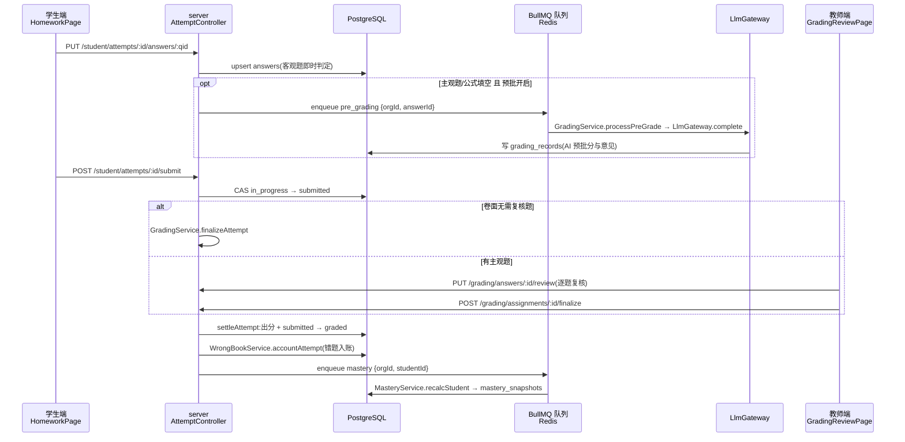
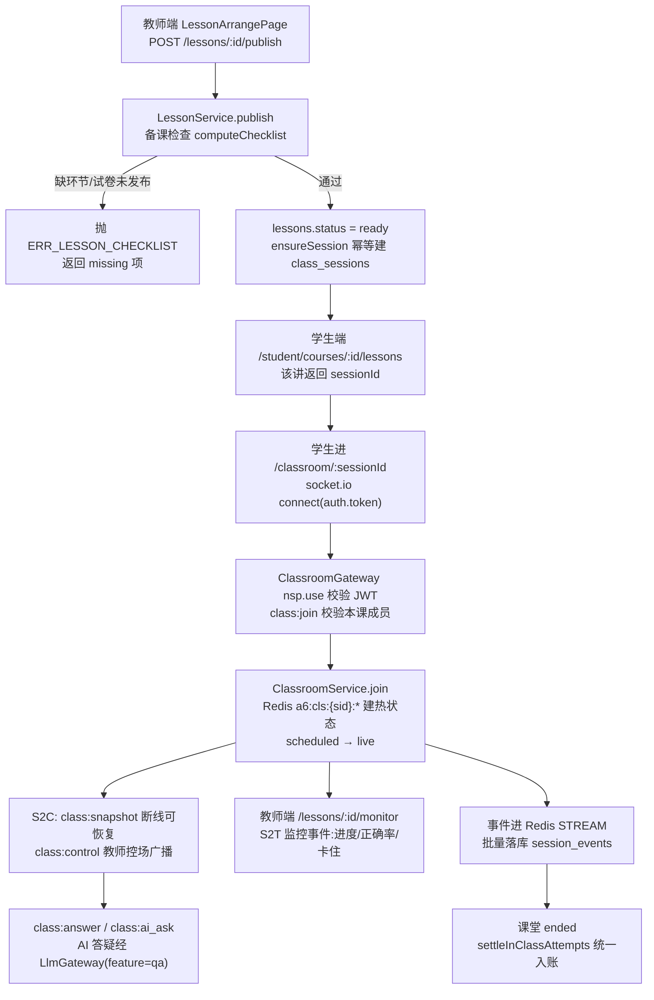

# 01 · 架构总览

> **这篇写给谁**:准备改这个仓库代码的人(包括 AI 会话)。目标是回答两个问题——
> 「这个东西在哪」和「改它会影响谁」。想快速上手请直接跳到 [常见改动指南](#十常见改动指南)。
>
> 本文以**当前实际代码**为准。若与 `启明智学-开工包/` 下的设计文档、任务卡冲突,以代码为准;
> 已发现的不一致列在 [已知结构性债务与陷阱](#十一已知结构性债务与陷阱)。

---

## 一、项目一句话

启明智学(代码内标识 `@qiming/*`,部分文档写作「鲸云AI教育平台」)是一个面向 K12 培训机构的
**多租户 AI 教学平台**:管理端管机构/师生/课程与 AI 开销,教师端做题库、组卷、讲次编排、批改与课堂监控,
学生端做作业、错题本、实时课堂与 AI 答疑;AI 能力(答疑、预批、课堂伴学、学情诊断、生成课件)
统一经后端一个 LLM 网关接入,可按功能在真实供应商与 mock 之间切换。

## 二、技术栈总表

| 层 | 选型 | 位置 |
|---|---|---|
| 后端框架 | NestJS 10(Express 平台) | `apps/server` |
| ORM / 数据库 | Prisma 5 + PostgreSQL 16 | `apps/server/prisma` |
| 缓存 / 热状态 / 队列 | Redis 7 · ioredis · BullMQ 5 | `apps/server/src/redis`、各 `*.queue.ts` |
| 实时通信 | socket.io 4 + `@socket.io/redis-adapter` | `apps/server/src/classroom` |
| 认证 | 自研 JWT(`@nestjs/jwt`)+ argon2 密码哈希 | `apps/server/src/auth` |
| 日志 | pino / nestjs-pino(敏感字段脱敏) | `apps/server/src/common/logging` |
| 前端 | React 18 + TypeScript 5 + Vite 5 + react-router 6 | `apps/{admin,teacher,student,lab}` |
| 样式 | Tailwind 3 + design-tokens 生成的预设 | `packages/ui/tailwind-preset.ts` |
| 前端 mock | MSW 2(按 openapi.yaml) | 各端 `src/mocks/` |
| 测试 | 后端 Jest + supertest(e2e);前端 Vitest | `apps/server/test`、各端 `src/**/__tests__` |
| 契约 | OpenAPI 3 + openapi-typescript 生成类型 | `packages/contracts` |
| 部署 | Docker Compose + nginx(单端口路径分端) | `deploy/` |

**没有 monorepo 工具链**:仓库根**没有** `package.json`、没有 pnpm workspace / turbo / lerna。
每个 app 和 `packages/ui`、`packages/contracts` 各自持有 `package-lock.json`,依赖各自 `npm install`。
跨包引用靠 **TS path 映射 + Vite alias 直接指向源码**(不经过构建产物),见第四节。

## 三、目录地图

```
qiming/
├── apps/
│   ├── server/       NestJS 后端(唯一后端)
│   ├── admin/        管理端  Vite React
│   ├── teacher/      教师端  Vite React
│   ├── student/      学生端  Vite React
│   └── lab/          本地实验区(永不部署)
├── packages/
│   ├── contracts/    API/WS/设计令牌契约 —— 全仓「唯一事实」,受宪法保护
│   └── ui/           跨端共享 React 组件 + Tailwind 预设
├── data/             知识图谱与真题导入源数据(JSON)
├── deploy/           生产编排:compose.prod / nginx / Dockerfile(web) / 备份与部署脚本
├── docker-compose.dev.yml   本地 Postgres + Redis
├── docs/             ← 本目录
└── README.md         交付记录/变更日志(按任务波次追加,不是架构说明)
```

### 各 app / package 一览

| 目录 | 包名 | 职责 | 开发端口 | 启动 |
|---|---|---|---|---|
| `apps/server` | `@qiming/server` | 全部业务 API(`/api/v1`)、WS 课堂网关、队列 worker、AI 网关 | 3000 | `npm run start:dev` |
| `apps/admin` | `@qiming/admin` | 机构管理员:师生/课程/名单、AI 用量与接口配置、实验室管理、平台设置 | 5173 | `npm run dev` |
| `apps/teacher` | `@qiming/teacher` | 教师:题库、试卷库、讲次编排与发布、作业、批改复核、课堂监控、学情分析、AI 生成课件 | 5174 | `npm run dev` |
| `apps/student` | `@qiming/student` | 学生:今日、课程时间线、作业作答、错题本、报告、实时课堂 + AI 答疑 | 5175 | `npm run dev` |
| `apps/lab` | `@qiming/lab` | 产品实验区(动态讲义、知识点动画);**不进 deploy、不进生产** | 5176 | `npm run dev` |
| `packages/contracts` | `@qiming/contracts` | `openapi.yaml` + `dto.ts` + `ws-protocol.ts` + `design-tokens.ts` + 类型化 fetch 客户端 | — | 无需构建 |
| `packages/ui` | `@qiming/ui` | Button/Card/Table/Modal/Toast/MathInput/OssImage 等 20 个组件 + Tailwind 预设 | — | 无需构建 |

本地起全栈的最短路径:

```bash
docker compose -f docker-compose.dev.yml up -d          # Postgres 5432 + Redis 6379
cd apps/server && npm install && cp .env.example .env
npm run db:apply-sql && npm run db:seed:base && npm run db:import-kp && npm run db:seed:business
npm run start:dev                                        # :3000

cd ../teacher && npm install
VITE_USE_MOCK=false npm run dev                          # :5174,打真后端
```

前端默认走 **MSW mock**(`.env.development` 里 `VITE_USE_MOCK=true`),可完全离线开发;
要连真后端必须显式 `VITE_USE_MOCK=false`(mock 是 opt-in,变量拼错会 fail-safe 走真实后端)。

---

## 四、跨包依赖是怎么连起来的

这是本仓最容易踩坑的一处机制,单独说明。

`@qiming/contracts` 和 `@qiming/ui` 的 `package.json` 里 `main` 指向 `src/index.ts`(**源码**),
**从不构建产物**。消费方通过三处配置同时指向源码:

| 消费方 | 类型解析 | 运行/打包解析 |
|---|---|---|
| 四个前端 | `tsconfig.json` 的 `paths` + `include` 把 `packages/*/src/**` 纳入编译 | `vite.config.ts` 的 `resolve.alias` |
| server | `tsconfig.json` 的 `paths`(只映射 contracts,不用 ui) | 生产靠 `tsconfig-paths/register`(见 `start` 脚本与 `TS_NODE_BASEURL`) |

后果(务必记住):

- **改 `packages/*` 的源码,四端的 `tsc --noEmit` 立刻受影响**,不存在「先发布再升级」的缓冲期。
- `packages/ui` 的运行时依赖(katex、qrcode)装在 `packages/ui/node_modules`,由 ui 目录自己 `npm install`;
  Docker 构建里有专门的 `pkgs` 阶段执行 `cd packages/ui && npm ci`。加 ui 依赖要记得这一层。
- Vite 的 `server.fs.allow` 在 teacher/lab 里显式放开了仓库根,否则 dev server 读不到 `packages/`。

---

## 五、后端架构(apps/server)

### 5.1 请求生命周期

`src/main.ts` 做四件事:生产环境变量 fail-fast(`assertProductionEnv`)、全局前缀 `api/v1`(`/healthz` 例外)、
CORS 白名单、`listen(PORT ?? 3000)`。

`src/app.module.ts` 装配的全局链路(**改动前必读,顺序有意义**):

```
ContextMiddleware        为每个请求开 AsyncLocalStorage store(租户上下文)
  ↓
JwtAuthGuard (APP_GUARD) 校验 Bearer JWT → req.user + ALS.user;@Public() 跳过
  ↓                      另查 Redis 密码重置吊销位(Redis 挂了 fail-open + 告警)
RolesGuard  (APP_GUARD)  校验 @Roles('teacher'|'student'|'admin')
  ↓
ValidationPipe(APP_PIPE) whitelist + transform,DTO 用 class-validator
  ↓
Controller → Service → PrismaService.client(自动注入 org_id)
  ↓
TransformInterceptor     成功响应统一包 { code: 0, message: 'ok', data }
AllExceptionsFilter      失败统一包 { code, message, detail },业务码见 common/biz-codes.ts
```

**多租户是靠 Prisma 扩展从机制上兜住的**(`src/prisma/prisma.service.ts`):
`PrismaService.client` 是 `$extends` 过的客户端,对所有模型的读/改/删自动 `AND { orgId }`,
create/createMany/upsert 自动填 `orgId`;**没有租户上下文时直接抛错**,而不是查全表。
队列 worker 和 WS 处理器没有 HTTP 请求上下文,统一用 `runAsUser({uid,orgId,role}, fn)` 手动开上下文
(见 `src/common/tenant-context.ts`)。

### 5.2 模块划分

`src/` 下一个目录 = 一个 Nest 模块,基本是 `x.module.ts` / `x.controller.ts` / `x.service.ts` / `x.dto.ts` 四件套。
按领域分组(共 24 个业务模块 + `common/`):

| 分组 | 模块目录 | 主要对外路由 |
|---|---|---|
| 基础设施 | `prisma`、`redis`、`audit`、`common` | 无(横切) |
| 认证 | `auth` | `POST /auth/login`、`/auth/student/login`、`/auth/refresh`、`/auth/logout`、`GET /me`、`PUT /me/password` |
| 机构管理 | `admin`(拆出 teachers / students / courses / insights / sms 五个 service) | `/admin/**`(36 个端点:师生 CRUD、名单、dashboard、AI 用量与配额、AI 接口配置、审计日志、功能开关) |
| 知识图谱 | `kp`、`knowledge` | `/kp/graphs`、`/kp/nodes`、`/knowledge/content-packs/**` |
| 题库与试卷 | `question`、`paper` | `/questions/**`、`/papers/**` |
| 课程与讲次 | `course`、`lesson`、`resource` | `/teacher/courses`、`/courses/:id/lessons`、`/lessons/:id[/segments|/publish]`、`/resources/**` |
| 作业与作答 | `assignment`、`attempt` | `/assignments/**`(教师)、`/student/attempts/**`、`/student/assignments`(学生) |
| 批改与学情 | `grading`、`mastery`、`wrongbook`、`analytics` | `/grading/**`、`/student/wrong-book/**`、`/analytics/**` |
| 实时课堂 | `classroom` | **WS** `/socket.io` namespace `/classroom`(无 REST) |
| 学生杂项 | `student`(`student-misc`) | `/student/today`、`/student/courses/**`、`/student/report`、`/student/resources/:id/view` |
| 文件 | `upload` | `/uploads/sts`、`/uploads/view-url`、`PUT /uploads/local/:token`、`@Public GET /storage/*` |
| AI | `ai`(含 `llm/`、`features/`、`ocr/`、`config/`) | `/ai/qa`、`/ai/health`(admin 侧配置在 `/admin/ai/**`) |
| AI 课件 | `courseware` | `/courseware/outline`、`/courseware/jobs[/:jobId[/retry]]` |
| 功能开关 | `features` | `/features/my`、`/admin/features/**` |

对外 API 的组织方式:**openapi.yaml 是唯一事实**(当前 81 个路径),Nest 侧的 `@Controller` 前缀刻意
与 openapi 路径对齐,`main.ts` 加 `api/v1` 全局前缀。角色边界写在装饰器上:
`@Roles('teacher')` 之类标在 controller 或方法,不标 = 仅需登录,`@Public()` = 完全放开
(只有 `/healthz`、登录/刷新、两个签名 URL 端点是 `@Public`)。

### 5.3 数据库表概览

`prisma/schema.prisma` 是数据库唯一事实,**32 张表 / 20 个枚举**,全部 `@@map` 到 snake_case 表名。
除 `orgs` 外每张业务表都带 `org_id`,唯一键都含 org 维度。按领域分组:

| 领域 | 表 |
|---|---|
| 租户与账号 | `orgs`、`users`(admin/teacher/student 同表,靠 `role` 区分)、`devices`、`login_tickets` |
| 课程与教学 | `courses`、`course_students`(在册/退班)、`lessons`、`lesson_segments`(warmup/lecture/practice/homework 等环节)、`resources` |
| 三维知识图谱 | `kp_graphs`(教材/能力/策略三类图)、`kp_nodes`、`kp_edges`(先修等关系)、`kp_content_packs` |
| 题库与试卷 | `questions`、`question_options`、`question_tags`(同时承载知识点+能力+策略标注,由 node 所属图谱区分)、`papers`、`paper_questions` |
| 作业与作答 | `assignments`(kind: homework/in_class/correction/consolidation/wrong_redo)、`attempts`、`answers`、`grading_records` |
| 学情 | `wrong_book_entries`、`mastery_snapshots` |
| 实时课堂 | `class_sessions`、`session_participants`、`session_events` |
| AI 与治理 | `ai_calls`(逐次调用全归因)、`ai_quotas`(月额度+超额策略)、`audit_logs`、`feature_flags`、`feature_access` |

迁移在 `prisma/migrations/`,目前 4 个:`0001_init`(全量)、`0002_assignment_teacher`、
`0003_ai_feature_courseware`(枚举加值)、`0004_feature_flags`(两张表)。
**手写 SQL 与 schema.prisma 并存**:0001 提供等价 SQL(`npm run db:apply-sql`),
`prisma migrate dev` 也能用;生产由镜像 entrypoint 跑 `prisma migrate deploy`。

### 5.4 认证方式

- 两个登录入口:`POST /auth/login`(手机号+密码,管理员/教师)与 `POST /auth/student/login`(学号+密码)。
- 返回 access token(默认 2h)+ refresh token(默认 14d),payload 含 `uid / orgId / role / typ`。
  `typ === 'refresh'` 的 token 在 access 校验路径上被拒。
- 密码 argon2(`auth/password.util.ts`);重置密码时往 Redis 写一个吊销时间戳,
  `JwtAuthGuard` 比对 `iat` 使旧 token 立即失效。
- 前端把 token 存在**内存 + localStorage**(`src/auth/token.ts`,各端 key 不同),
  `createClient` 自动带 `Authorization`,遇 401 统一清 token 跳登录。
- WS 不走 HTTP 守卫:`ClassroomGateway` 在 `nsp.use` 里自己校验 `handshake.auth.token`
  (与 `JwtAuthGuard` 同口径),是否本课成员在 `class:join` 时校验。

### 5.5 Redis 的四种用途(键前缀是纪律)

| 用途 | 键 | 前缀开关 |
|---|---|---|
| 课堂热状态(meta / 每人状态 / 事件流 / 卡住 ZSET) | `a6:cls:{sid}:*` | `CLS_REDIS_PREFIX` |
| BullMQ 队列(`pre_grading`、`mastery`、`courseware`) | `a5:<queue>:*` | `BULLMQ_PREFIX` |
| AI 运行态配置与计量(供应商配置、路由覆盖、月成本、告警守卫) | `a7:ai:*` | 无 |
| 一次性凭证(上传 token、密码重置吊销位、课件任务态 24h TTL) | 各模块自管 | 无 |

前缀存在的理由是**多部署共用一台 Redis 时互不抢任务**;两个前缀都是**运行期惰性读取**
(早期在模块顶层求值,导致写在 `.env` 里的值静默失效,已修)。禁止 `FLUSHALL/FLUSHDB`。

### 5.6 AI 能力如何接入

```
业务模块(qa / pre-grading / companion / diagnosis / courseware)
        │  只依赖 LlmGatewayService 接口,不 import 任何供应商 SDK(宪法红线)
        ▼
LlmGatewayService  ── 额度预检(Redis 月成本 × ai_quotas.over_policy)
 (ai/llm/)         ── RouteTableService.resolve(feature) → provider/model/fallback
                   ── 全局并发闸 Semaphore(默认 8,可运行态调)
                   ── 供应商调用(主路由失败切 fallback;生图 fallback 恒为 null)
                   ── 计量落账:写 ai_calls + Redis INCRBYFLOAT 月成本 + 达阈值写 audit_logs
        ▼
providers/  mock · openai_compatible(文本)   |   mock_image · openai_compatible_image(生图)
```

要点:

- **五个 feature**:`qa`、`pre_grading`、`class_companion`、`diagnosis`、`courseware`
  (枚举同时存在于 `packages/contracts/src/dto.ts` 和 prisma 的 `AiFeature`)。
- **路由表三层**:`ai/config/ai-routes.default.json`(默认,全 mock)→ env 感知
  (配了 `LLM_API_KEY` 则四个文本能力默认走真实;配了 `IMAGE_API_KEY` 则 courseware 走真实生图)
  → Redis `a7:ai:routes` 覆盖(管理端 `PUT /admin/ai/routes` 逐功能切真假,不重启生效)。
- **提示词与模板是文件而非硬编码**:`ai/config/*.md` 与 `*.json`(答疑引导/朴素两版、预批、课件大纲与风格、
  伴学模板、诊断模板、答疑审查规则),由 `ai/config-loader.ts` 加载,可用 `AI_CONFIG_DIR` 覆盖目录。
- **文本与生图是两套独立 env**(`LLM_*` / `IMAGE_*`),各自的 key 只在 provider 内部读取,不进日志。
- **批改域的接缝**:`grading` 不直接依赖 `ai`,而是注入 `AI_GATEWAY` token(定义在 `grading/ai/ai-gateway.ts`),
  由 `grading.module.ts` 绑到 `AiModule` 导出的 `LlmPreGradeGateway`。同目录的 `stub-ai-gateway.ts` 已不再接线。
- OCR 目前是 stub(`ai/ocr/ocr.service.ts` 的 `LocalOcrStub`),拍照预批因此被功能开关置为 `off`。

### 5.7 异步与实时

- **三条 BullMQ 队列**,Queue 与 Worker 都在同一个 Nest provider 里创建(同进程消费,无独立 worker 进程):
  `grading/pre-grading.queue.ts`(并发 5)、`mastery/mastery.queue.ts`(并发 5)、`courseware/courseware.queue.ts`。
  worker 里必须 `runAsUser` 补租户上下文;`attempts: 2`,失败落日志。
- **课堂 WS**:`classroom/classroom.gateway.ts`,namespace `/classroom`,服务端 ping 25s。
  事件处理器用**原生 `socket.on` 而非 `@SubscribeMessage`**——全局守卫/拦截器会污染 ack 形状,
  所以网关内自管鉴权、租户上下文与异常通道(`emit('exception')`)。
  事件名与负载严格遵守 `packages/contracts/src/ws-protocol.ts`(`C2SEvents` / `S2CEvents` / `S2TEvents`)。
- **文件存储**:`upload/storage/` 有 local 与 oss 两个适配器,`STORAGE_DRIVER` 切换;
  当前生产用 local,落 `/app/storage`(命名卷)。回看是**两跳**:
  `GET /uploads/view-url?ossKey=`(带 token)拿签名直链 → `@Public GET /storage/*`。

### 5.8 功能开关(内测分级)

三级流水线 `off → beta(白名单) → ga`。**功能目录是代码内静态注册表**
(`features/feature-catalog.ts`,含 known issues 与转正验收条件),库里只存覆盖值:
`feature_flags` 存机构级阶段覆盖,`feature_access` 存 beta 白名单。
后端硬门禁 `FeatureGateService.assertEnabled`,前端经 `GET /features/my` 渲染并做路由门禁。
当前两项:`ai_courseware`(teacher,beta)、`photo_pregrade`(student,off)。

---

## 六、前端架构(admin / teacher / student)

### 6.1 三端共同骨架

admin / teacher / student 三端结构高度一致,看懂一个就看懂其余(lab 是简化版:没有 `api.ts`、`auth/`、`mocks/`):

```
src/
├── main.tsx        入口:mock opt-in 判定 → ErrorBoundary → BrowserRouter(basename 取 BASE_URL)→ ToastProvider → App
├── App.tsx         路由表:/login 独立,其余套 <Shell> 布局路由
├── api.ts          唯一的接口出口:createClient({ getToken, onUnauthorized }) + GetData/PostData 类型工具
├── auth/           token.ts(内存 + localStorage)、AuthProvider(未登录 → Navigate /login)
├── features/       FeaturesProvider(拉 /features/my)、FeatureGuard(路由门禁)
├── pages/          Shell.tsx(导航 NAV_ITEMS + 布局)+ 按业务分子目录
│   └── <业务>/      页面组件 + components/ + lib/(纯函数)+ lib/__tests__/
└── mocks/          browser.ts(MSW worker)、handlers.ts、data.ts,及 __tests__/
```

**状态管理没有引入任何库**——没有 Redux/zustand/react-query。状态就三层:
组件内 `useState/useEffect` 直接调 `api`、`AuthProvider`/`FeaturesProvider`/`ToastProvider` 三个 Context、
以及复杂交互抽出的**纯函数 + 显式状态机**(如学生端 `pages/homework/machine.ts`、
`pages/classroom/machine.ts` 与 `useClassroom.ts`)。测试主要打在这些 `lib/` 纯函数与 machine 上。

### 6.2 各端页面结构

**admin(5173)** — 单层扁平页面,导航即路由:

| 路由 | 页面 |
|---|---|
| `/` | 数据总览 Dashboard |
| `/teachers`、`/students`、`/courses` | 组织与账号(配 `components/` 下的 8 个弹窗:名单、表单、重置密码、白名单等) |
| `/ai-usage`、`/ai/config` | AI 用量与开销、AI 接口管理(真假路由切换) |
| `/features`、`/settings` | 实验室管理、平台设置 |

**teacher(5174)** — 页面最多,按业务分区:

| 路由 | 页面 |
|---|---|
| `/` | 工作台 Dashboard |
| `/courses`、`/lessons/:id/arrange`、`/lessons/:id/paper`、`/lessons/:id/monitor` | 我的课程 → 讲次编排 → 组卷 → 课堂监控 |
| `/assignments`、`/grading`、`/grading/:assignmentId` | 作业总览、批改首页与复核页 |
| `/papers`、`/papers/new`、`/papers/:id/edit` | 试卷库 |
| `/bank`、`/bank/new`、`/bank/:id/edit` | 题库维护与录题(含公式键盘、插图上传) |
| `/knowledge`、`/resources`、`/analytics` | 知识点内容库、资源库、学情分析 |
| `/courseware/new` | AI 生成课件三步向导,**外面套 `<FeatureGuard>`** |
| `/lab` | 实验室分区(按 `/features/my` 决定是否出现在导航) |

**student(5175)** — 面向移动端触屏:

| 路由 | 页面 |
|---|---|
| `/` | 今日 TodayPage |
| `/courses` | 课程时间线(讲次 → 进课堂 / 看作业) |
| `/homework`、`/homework/:assignmentId` | 作业历史列表、作答页(答题卡 + 拍照 + 公式输入 + 成绩单) |
| `/wrong-book`、`/report` | 错题本、学习报告 |
| `/classroom/:sessionId` | **整屏接管、不挂 Shell** 的实时课堂:warmup/lecture/practice/summary 四段 + AI 答疑面板 |

**lab(5176)** — 没有路由表,`src/experiments/registry.ts` 是登记表,首页按表列清单;
`public/animations/` 放单文件零依赖交互 HTML(有 `tools/validate-animations.mjs` 校验器)。
**永不部署**:不在 `deploy/web.Dockerfile` 里。

### 6.3 contracts 的使用方式(硬纪律)

1. **禁止手写 fetch**。所有请求经 `src/api.ts` 的 `api.get/post/put/del`,
   路径、path 参数、query、body、响应类型全部由 `openapi.yaml` 生成的类型推断,写错路径直接编译报错。
2. **禁止本地重复定义 DTO/枚举**,一律 `import type { XxxDto } from '@qiming/contracts'`;
   页面需要某端点响应类型时用 `GetData<'/path'>` / `PostData<'/path'>` 从客户端签名反推,
   而不是 `as SomeLocalType`(后者形状部分重叠也能过,契约变了不报错)。
3. **禁止裸写十六进制色值**,颜色只能来自 `design-tokens`,经 Tailwind 预设以类名使用
   (预设对 `theme.colors` 做的是**整表替换**,裸色根本没有对应类名)。
4. 例外只有两处,都在 `api.ts` 里集中处理并写了注释:`GET /uploads/view-url`
   (未进 openapi,做了类型放宽)与预签名直传的 `PUT uploadUrl`(不是契约端点,允许原生 fetch)。

`packages/contracts` 受宪法保护:**改它需要先提「契约变更申请」并经人工批准**,
改完要跑 `npm run gen:sdk` 重新生成 `src/generated/api-types.ts` 与 `npm run lint:openapi` 校验。

### 6.4 ui 的使用方式

`import { Button, Card, Table, ... } from '@qiming/ui'`,导出清单见 `packages/ui/src/index.ts`。
两个值得单独知道的组件:

- `OssImage` / `QuestionFigures` + `resolveOssUrl(Async)`:题目插图的统一渲染入口。
  teacher / student 在各自 `api.ts` 里提供 `resolveFigureSrc`,内部按 ossKey 异步换签名直链并缓存;
  mock 模式返回占位 SVG data URL,不发网络请求。
- `MockBadge`:mock 模式在右下角显示角标,防止把假数据当真数据。admin/teacher/student 的 `App.tsx` 都挂了。

### 6.5 mock 模式

MSW 按 `openapi.yaml` 拦截 `/api/v1/**`,handler 在 `src/mocks/handlers.ts`、
数据在 `src/mocks/data.ts`(**禁止把 mock 数据散落进组件**)。三点安全护栏:

- mock 是 opt-in:只有 `VITE_USE_MOCK === 'true'` 才启;生产构建若检测到该值直接 throw。
- 真实模式启动时会注销上一次残留的 MSW service worker 并重载(否则请求会挂死)。
- 学生端课堂 WS 的 mock 是一个 **Vite 插件**(`mockClassroomWs`),把假 socket.io 服务挂到 dev server;
  teacher 的监控页数据源判定在 `pages/monitor/source.ts`。

各端还有 `npm run test:mock`(`scripts/mock-smoke.mts`)做 handler 冒烟。

---

## 七、典型数据流

### 7.1 学生交作业 → 出分 → 错题本与掌握度



关键约束:`finalize` 前若还有未复核的主观题会抛 `ERR_GRADING_PENDING` 并返回 `pendingAnswerIds`;
订正/重做类作业 `score_counted=false` 不计分。

### 7.2 教师发布讲次 → 学生进入实时课堂



`sessionId == null` 表示课堂尚未就绪,前端必须给准确文案而不是放行进入(这是修过的历史坑)。

---

## 八、运行与部署

**开发**:`docker-compose.dev.yml` 只起 Postgres 16 + Redis 7(端口直接暴露到宿主),
server 与前端都在宿主本机跑,前端 dev server 用 Vite proxy 把 `/api` 与 `/socket.io` 转到 `:3000`。

**生产**(`deploy/docker-compose.prod.yml`,四个服务):

```
             ┌────────── web (nginx:80) ──────────┐
浏览器 ──────>│  /          → student/ 静态产物     │
             │  /admin/    → admin/   (base=/admin/)   │
             │  /teacher/  → teacher/ (base=/teacher/) │
             │  /api/**, /healthz, /socket.io/** → 反代 │
             └──────────────────┬──────────────────┘
                                ▼
                        server (NestJS :3000)
                          ├── postgres(命名卷 pgdata,不暴露宿主端口)
                          └── redis(AOF,命名卷 redisdata)
                        serverstorage 卷 → /app/storage(local 上传)
```

- **单端口路径分端**是有意选择:国内很多校园/家庭网络只放行 80/443,用 8081/8082 分端会打不开。
  代价是前端要按 `VITE_BASE` 构建、router `basename` 必须跟着走。
- 两个 Dockerfile 的**构建上下文都必须是仓库根**(因为要拷 `packages/`):
  `apps/server/Dockerfile`(build → proddeps → runtime 三阶段,非 root,`/healthz` HEALTHCHECK)、
  `deploy/web.Dockerfile`(三端各自独立构建阶段 + `pkgs` 阶段装 ui 依赖,产物合入一个 nginx 镜像)。
- 容器 entrypoint 默认先跑 `prisma migrate deploy`(`AUTO_MIGRATE=0` 可关)再启动。
- 生产必填 env 有启动期 fail-fast:`DATABASE_URL`、`REDIS_URL`、`JWT_SECRET`(不得为 dev 默认值)、
  `CORS_ORIGINS`(非空)、`UPLOAD_PUBLIC_BASE`。详见 `apps/server/.env.example` 与 `deploy/部署手册.md`。
- 生产初始化用 `npm run init:prod`,**不要跑演示 seed**。

---

## 九、测试与门禁

| 范围 | 命令 | 位置 |
|---|---|---|
| 后端 e2e(真库真 Redis) | `cd apps/server && npm test` | `test/*.e2e-spec.ts` + `test/fixtures/` |
| 前端单测 | admin/teacher/student 与 `packages/ui` 各跑 `npm run test`(vitest;lab 无测试) | `src/**/__tests__/` |
| 前端 mock 冒烟 | admin/teacher/student 各跑 `npm run test:mock` | `scripts/mock-smoke.mts` |
| 类型门禁 | 各端 `npm run build`(先 `tsc --noEmit`)、`packages/*` 的 `npm run check` | — |
| 契约校验 | `cd packages/contracts && npm run lint:openapi` | swagger-parser |

e2e 用真实 Postgres 与 Redis(不是内存 mock),跑之前要有库和 seed;
`E2E_LLM_ISOLATION=1` 强制 AI 全走 mock。`test/jest-e2e.config.cjs` 开了 ts-jest
`isolatedModules`(transpile-only),所以 **e2e 绿不代表类型没问题**,类型由各端 build 守门。

---

## 十、常见改动指南

> 每条给「动哪些文件(按顺序)」和「注意什么」。这是本文档最该常读的一节。

### A. 新增一个后端 API 端点

1. `packages/contracts/openapi.yaml` 加路径与响应 schema →
   `packages/contracts/src/dto.ts` 加/改 DTO 类型 → `cd packages/contracts && npm run gen:sdk && npm run lint:openapi`。
2. `apps/server/src/<模块>/x.dto.ts` 加 class-validator 的请求 DTO(全局 `ValidationPipe` 是 `whitelist: true`,
   **DTO 里没声明的字段会被静默丢掉**)。
3. `x.controller.ts` 加方法 + `@Roles(...)`;`x.service.ts` 写逻辑,数据库只走 `this.prisma.client`。
4. `apps/server/test/` 加 e2e,**必须含跨租户 404 用例**(宪法第 7 条)。
5. 前端调用侧:`api.get('/新路径')` 即可,类型自动来;mock 模式下还要在对应端
   `src/mocks/handlers.ts` 加 handler,否则 mock 下该页会空。

⚠️ **契约是宪法保护对象**:改 `packages/contracts` 需要先提「契约变更申请」经人工批准,
并把变更追加到 `启明智学-开工包/01-项目宪法.md` 的契约变更记录。
⚠️ 新端点若三端都要用,记得它同时影响四个前端的 `tsc`(生成的 api-types 变了)。

### B. 改数据库表结构

1. `apps/server/prisma/schema.prisma` 改模型(记得 `orgId` 与含 org 维度的唯一键)。
2. 新建 `prisma/migrations/000N_<描述>/migration.sql` 手写等价 SQL(参考 0002/0004 的写法与注释风格);
   PG 的 `ALTER TYPE ... ADD VALUE` 有事务限制,单独一个文件放一条语句(见 0003)。
3. `npx prisma generate` 重新生成 Client;本地库用 `npm run db:apply-sql` 或 `prisma migrate dev` 灌。
4. 如果字段要透出到前端:回到 A 流程改契约 DTO。
5. 影响 seed 与导入工具:`prisma/seed.ts`、`tools/import-kp.ts`、`tools/import-exams.ts`、`tools/init-prod.ts`。
6. 前端 mock 数据 `src/mocks/data.ts` 若少了新必填字段,**四端 `tsc` 会红**(踩过多次)。

⚠️ 生产迁移由镜像 entrypoint 的 `prisma migrate deploy` 执行,迁移必须可重复执行/幂等友好。

### C. 新增教师端(或任一前端)页面

1. `src/pages/<业务>/XxxPage.tsx`;复杂逻辑抽到同目录 `lib/*.ts` 纯函数并配 `lib/__tests__/`。
2. `src/App.tsx` 加 `<Route>`(注意放在 `<Shell>` 布局路由内;整屏页面如学生课堂放在外面)。
3. `src/pages/Shell.tsx` 的 `NAV_ITEMS` 加导航项(teacher/admin 有 `group` 分组字段)。
4. 数据:`import { api } from '../../api'` 直接调;**加载失败要显式区分错误态(可重试)与空态**——
   把失败吞成空态并配「暂无数据」文案是本仓修过多次的历史 bug。
5. mock:`src/mocks/handlers.ts` + `data.ts` 补数据。
6. 内测功能:在路由外层套 `<FeatureGuard featureKey={...}>`,并在
   `apps/server/src/features/feature-catalog.ts` 登记 key。

### D. 改共享 UI 组件(`packages/ui`)—— 影响所有端

1. 改 `packages/ui/src/Xxx.tsx`;新组件要在 `packages/ui/src/index.ts` 显式导出(不是 `export *`)。
2. 加测试 `packages/ui/src/__tests__/Xxx.spec.tsx`,跑 `cd packages/ui && npm run test && npm run check`。
3. **然后必须回归四个前端**:`admin`、`teacher`、`student`、`lab` 各跑 `npm run build`(含 `tsc --noEmit`),
   前三端另跑 `npm run test`(lab 没有 test 脚本)。因为四端是**直接编译 ui 源码**的,没有版本缓冲。
4. 改 props 形状时优先**放宽**(如 `resolveSrc` 从同步拓宽为可同步可异步),避免同时改四端调用点。
5. 需要新的运行时依赖:装到 `packages/ui`(它有独立 `package.json`/`package-lock.json`),
   并确认 `deploy/web.Dockerfile` 的 `pkgs` 阶段能装上。
6. 颜色/圆角/阴影只能取自 `design-tokens`;要新增设计令牌属于**改契约**,走 A 的审批流程。

### E. 改 AI 能力(提示词 / 路由 / 新增能力)

- **只改提示词或模板**:改 `apps/server/src/ai/config/` 下的 `.md` / `.json`,不用改代码。
  注意生产镜像里 `src/` 是被拷进去的,`config-loader` 按 `<cwd>/src/ai/config` 解析。
- **改真假路由/并发/单价**:优先走管理端 `PUT /admin/ai/routes` / `PUT /admin/ai/config`(写 Redis,热生效);
  改默认值才动 `ai/config/ai-routes.default.json`。
- **新增一个 AI 能力**:`AiFeature` 同时存在于 `packages/contracts/src/dto.ts` 和 prisma 枚举
  → 需要契约变更 + 一个 `ALTER TYPE ADD VALUE` 迁移 → `ai-routes.default.json` 加路由与单价
  → `ai/features/` 加 service → `ai.module.ts` 注册与导出。
  **还要检查 `llm-gateway.service.ts` 的 `OVER_POLICY_BLOCKS`**:超额策略里没列进去的能力,
  额度用尽后仍会继续烧钱(`courseware` 就是因此补进 `disable_qa` 的)。
- **新增供应商**:实现 `ai/llm/types.ts` 的 `LlmProvider` 或 `ImageProvider`,
  在 `ai.module.ts` 的 useFactory 里 `register` / `registerImage`。业务模块永远不 import 供应商。

### F. 新增一条异步队列

1. 参考 `grading/pre-grading.queue.ts`:在模块内建 `Queue` + `Worker`,
   `connection: bullConnection(cfg)`、`prefix: queuePrefix(cfg)`,队列名常量放 `grading/queue.util.ts`。
2. **worker 里必须 `runAsUser({uid,orgId,role}, fn)`**,否则 Prisma 租户扩展会直接抛错。
3. 订阅 `worker.on('error')` 与 `on('failed')` 落日志(不订阅会静默丢任务,踩过)。
4. `onModuleDestroy` 关 worker 与 queue,否则 e2e 挂住不退出。

### G. 改课堂实时协议

1. `packages/contracts/src/ws-protocol.ts` 改事件与负载(**契约变更,需批准**)。
2. `apps/server/src/classroom/classroom.gateway.ts` 注册事件(用原生 `socket.on`,别用 `@SubscribeMessage`)、
   `classroom.service.ts` 写逻辑,热状态键统一走 `classroom/redis-keys.ts`(不要现拼字符串)。
3. 学生端 `pages/classroom/ws/client.ts` + `machine.ts` + `useClassroom.ts`;教师端 `pages/monitor/`。
4. mock 侧:学生端 `src/mocks/classroom-server.ts`(Vite 插件挂的假 socket.io 服务)。
5. `ClassSnapshot` 是断线恢复的唯一依据,加字段时要考虑重连后的一致性。

### H. 改认证 / 权限

- 加角色限制:controller 或方法上的 `@Roles(...)`。**不标 = 仅需登录**,别忘了标。
- 全局放开某端点:`@Public()`(慎用,目前只有 healthz、登录/刷新、两个签名 URL 端点)。
- 改 token 内容或有效期:`auth/auth.service.ts` + `JWT_ACCESS_TTL/JWT_REFRESH_TTL`;
  payload 里 `uid/orgId/role` 被 `JwtAuthGuard`、`ClassroomGateway`、`runAsUser` 三处消费,改动面比看起来大。
- 前端 token 存储:各端 `src/auth/token.ts`(key 各端不同,不要复用)。

### I. 加环境变量

1. `apps/server/.env.example` 加带注释的条目(这份文件是 env 的事实清单)。
2. 生产必填的话,在 `src/common/env-assert.ts` 的 `assertProductionEnv` 加校验。
3. 代码里经 `ConfigService.get` 读,**不要在模块顶层求值 `process.env`**——
   那时 `ConfigModule.forRoot()` 还没把 `.env` 灌进去,写在 `.env` 里的值会静默失效(队列前缀和课堂前缀都踩过这个坑)。
4. 部署侧:`deploy/.env.prod.example` 与 `deploy/部署手册.md` 同步。

### J. 加一个内测功能开关

`apps/server/src/features/feature-catalog.ts` 加一条(key / 名称 / audienceRole / defaultStage /
knownIssues / acceptance)→ 后端在入口处 `FeatureGateService.assertEnabled` →
前端用 `<FeatureGuard>` 或 `FeaturesProvider` 判定渲染。
库表不用改(`feature_flags`/`feature_access` 只存覆盖值),管理端页面自动列出。

---

## 十一、已知结构性债务与陷阱

探索代码时发现的、会影响改动判断的事项:

1. **品牌名有两套**。目录/包名/库名是 `qiming`(启明智学),但 `qiming/README.md`、
   `deploy/nginx/qiming.conf` 等处标题写「鲸云AI教育平台」。文档里两个名字都会遇到,指的是同一个项目。
2. **`qiming/README.md` 不是架构文档**,是按任务波次追加的交付/修复日志(17KB,信息密度高但结构是时间序)。
   找「现在的样子」看本文档,找「为什么这么改」再去翻它。
3. **有三个真实依赖的端点没进 openapi**:`GET /uploads/view-url`、`PUT /uploads/local/:token`、
   `@Public GET /storage/*`。前端为此在 `api.ts` 里做了类型放宽和一处原生 fetch。宪法已把它记为待收口红线。
4. **多租户安全缺口(单机构暂不可触发)**:`users.phone` 无唯一约束、登录不带机构标识,
   第二家机构上线前必须先做(需要 `Org.code` + 登录带 orgCode + 复合唯一,动契约与 schema)。
   另有 paper/resource 缺行级 owner 写校验(同机构教师可改他人的卷/资源)。
5. **OCR 是 stub**(`ai/ocr/ocr.service.ts` 的 `LocalOcrStub`),拍照预批因此被功能开关置 `off`。
   另外 `grading/ai/stub-ai-gateway.ts` 是**已停用的历史实现**——`AI_GATEWAY` token 现在绑的是
   `ai/features/pre-grading.gateway.ts` 的 `LlmPreGradeGateway`(见 `grading/grading.module.ts`),
   改预批逻辑别改错文件。
6. **AI 生成课件的任务态只在 Redis**(24h TTL,不落库)。Redis 丢了任务就没了,只有成品 Resource 落库。
   真实生图链路尚未真机验证;课堂整页图(`CoursewarePageView.imageUrl`)没有生产者,课堂组装对该 feature 显式跳过。
7. **e2e 开了 transpile-only**,类型错位不会被 e2e 发现;必须靠各端 `npm run build` 与 `packages/*` 的 `check`。
8. **没有 CI**。所有门禁靠手动跑,改动跨包时很容易漏跑某一端。
9. **没有 monorepo 工具**,依赖各目录独立安装。装依赖前先确认自己在哪个目录;
   改 `packages/ui` 依赖要同时想到 Docker 的 `pkgs` 阶段。
10. **`apps/server/storage/` 有几百个本地上传的真实文件**(png/pdf)。已被 `.gitignore` 排除、不入库,
    但会淹没 `find` / 列目录的结果,搜索时记得排除该路径。
11. **前端「加载失败吞成空态」是反复出现的 bug 家族**,已修多处;新写页面请直接写错误态 + 重试按钮。
12. `apps/lab` 永不部署,别把它加进 `deploy/web.Dockerfile`;它也是唯一用 zod 的 app(与其他端技术选型不同)。

---

*生成日期:2026-08-31。本文基于当时代码状态(`main` 分支,最近提交 `4e35b79`,另含 `apps/lab`
「动态讲义」的未提交改动)撰写;重大改动后需更新——更新触发条件见 `docs/README.md` 的「维护要求」。*
